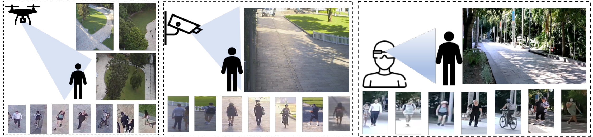

# AG-ReID

**Official repository for AG-ReID Competition**



## Dataset Download
The dataset is available for [Download](https://www.kaggle.com/competitions/ag-reid2023/data) now!

**FAQs:**

This FAQs page will be regularly updated as new information becomes available.

## Annotations 

Image Name: `P0001T03220A1C3F01111.jpg`
 
Person ID: `P0001T03220A1`

Camera: `C0: aerial, C2: wearable, C3: CCTV` 

Frame: `F01111`

## Person Re-Identification Evaluation Protocols

### Results

| Model     | Rank-1 | 
|-----------|--------|
| BoT (R50) | 78.42  |
| MGN (R50) | 79.27  |
| SBS (R50) | 74.94  |

## Benchmark Setup Guidance
1. Clone [FastReID project](https://github.com/JDAI-CV/fast-reid)  install it according to the provided guidelines.
2. [Download](https://www.kaggle.com/competitions/ag-reid2023/data) AG-ReID dataset to datasets/AG-ReID folder. Expected dataset structure:
```bash
datasets/
    AG-ReID/
      bounding_box_train/
      exp3_aerial_to_ground/
        bounding_box_test/
        query/
      exp6_ground_to_aerial/
        bounding_box_test/
        query/
      gallery_add_on/
        exp3_aerial_to_ground/
        exp6_ground_to_aerial/
      qut_attribute_v8.mat
```
3. Download [AGReID](configs/AGReID) folder put it in the fastreid project's `configs` folder
4. Download [agreid.py](fastreid/data/datasets/agreid.py) file and put it in the fastreid project's `fastreid/data/datasets` folder.
5. Add `from .agreid import AGReID` to fastreid project's `fastreid/data/datasets/__init__.py` file
6. Add [save_result.py](demo/save_result.py) to fastreid project's `demo` folder
7. Run the following to train SBS (R50) model. Make sure to download pretrain model [resnet50-19c8e357.pth](https://download.pytorch.org/models/resnet50-19c8e357.pth).
```bash
!python3 tools/train_net.py --config-file configs/AGReID/sbs_R50.yml \
MODEL.BACKBONE.PRETRAIN_PATH pretrain_models/resnet50-19c8e357.pth \
MODEL.DEVICE "cuda:0"
```
8. Run the following to get result for exp3_aerial_to_ground in `submit_aerial_ground.csv`.
```bash
source = 'datasets/AG-ReID'
dir_query_csv = source + '/query_exp3_aerial_to_ground.csv'
dir_gallery_csv= source + '/gallery_exp3_aerial_to_ground.csv'
dir_submit_csv = source + '/submit_aerial_ground.csv'

!python demo/save_result.py --config-file configs/AGReID/sbs_R50.yml \
--parallel   --dataset-name 'AGReID' \
--dir_query_csv $dir_query_csv\
--dir_gallery_csv $dir_gallery_csv\
--dir_submit_csv $dir_submit_csv\
--opts MODEL.WEIGHTS logs/agreid/bagtricks_R50/model_final.pth
```
9. Replace `test_choice = test_options[0]` with `test_choice = test_options[1]` in `fastreid/data/datasets/agreid.py` file to test ground to aerial setting.
10. Run the following to get result for exp6_ground_to_aerial in `submit_ground_aerial.csv`.
 ```bash
source = 'datasets/AG-ReID'
dir_query_csv = source + '/query_exp6_ground_to_aerial.csv'
dir_gallery_csv= source + '/gallery_exp6_ground_to_aerial.csv'
dir_submit_csv = source + '/submit_ground_aerial.csv'

!python demo/save_result.py --config-file configs/AGReID/sbs_R50.yml \
--parallel   --dataset-name 'AGReID' \
--dir_query_csv $dir_query_csv\
--dir_gallery_csv $dir_gallery_csv\
--dir_submit_csv $dir_submit_csv\
--opts MODEL.WEIGHTS logs/agreid/bagtricks_R50/model_final.pth
```
11. Merge `submit_aerial_ground.csv` and `submit_ground_aerial.csv` keep header. Merged file should contain 8500 rows including header. Submit file to AG-ReID competition on Kaggle for evaluation.  